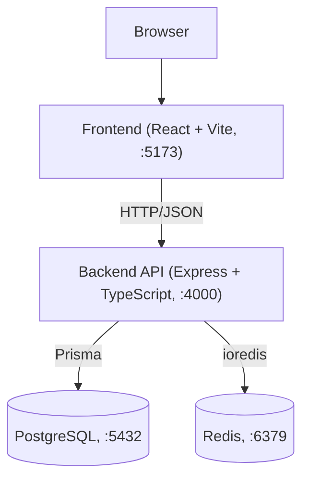
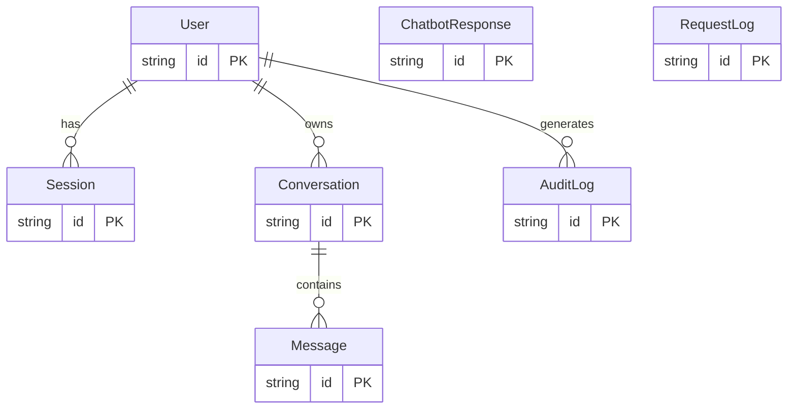

# ConvoScale

A backend-engineering case study: a chatbot-shaped messaging platform whose real purpose is to
demonstrate correct, scalable backend and database engineering — transactions, concurrency
control, idempotency, caching, rate limiting, and authentication/authorization — under a
measured load of approximately 10,000 requests/minute. The conversational logic itself is
deliberately simple (keyword matching, not AI); it exists only to generate realistic traffic for
the backend to process.

> **Scope note:** This README documents only what is implemented and verifiable in the code and
> test results at the time of writing. Anything from the original project brief that is not yet
> implemented is listed explicitly in Limitations / Future Improvements, not silently omitted.

Related documents: docs/API.md (full endpoint reference) · docs/ER-DIAGRAM.md (schema diagram) ·
docs/DEPLOYMENT.md (Railway/Vercel deployment guide) · docs/BUILD-LOG.md (day-by-day build
journal and troubleshooting) · loadtest/RESULTS.md (full load test output)

---

## Table of Contents

1. Project Overview and Goals
2. Architecture
3. Technology Stack
4. Project Structure
5. API Endpoints
6. Database Design and Relationships
7. Authentication and Authorization
8. Transactions / ACID
9. Concurrency and Idempotency
10. Database Indexes and Query Optimization
11. Pagination
12. Redis / Caching
13. Rate Limiting
14. Security
15. Error Handling and Logging
16. Testing
17. Docker / Local Setup
18. Environment Variables
19. Performance Results
20. Scalability Considerations
21. Deployment
22. Limitations / Future Improvements

---

## Project Overview and Goals

ConvoScale implements a messaging platform where authenticated users create conversations and
exchange messages with a rule-based chatbot. The application layer is intentionally simple; the
engineering weight is in:

- Correct, atomic multi-step database writes (transactions)
- Safe behavior under concurrent and duplicate requests (idempotency)
- Efficient reads at scale (indexed queries, cursor-based pagination)
- A caching layer that measurably reduces database load
- Defense against abuse (multi-tier rate limiting)
- Authentication with revocable sessions, and authorization enforced per-resource
- Verified, not claimed, performance under sustained load

## Architecture



- The frontend communicates with the backend exclusively over HTTP; it never touches the
  database or cache directly.
- The backend is the sole owner of business logic and the only component that talks to
  PostgreSQL and Redis.
- PostgreSQL and Redis run as Docker containers locally (docker-compose.yml) and as managed
  services in the deployment configuration (docs/DEPLOYMENT.md).

## Technology Stack

| Layer | Technology | Purpose |
|---|---|---|
| Runtime | Node.js 20, TypeScript | Backend execution and type safety |
| Web framework | Express 4 | HTTP routing and middleware pipeline |
| Database | PostgreSQL 16 | Primary datastore, chosen for real transaction/constraint/index support |
| ORM | Prisma 5 | Type-safe queries and migration history |
| Cache / rate-limit store | Redis 7 (ioredis) | Chatbot-response caching, distributed rate-limit counters |
| Auth | jsonwebtoken, bcryptjs | Token issuance/verification, password hashing |
| Validation | Zod | Request body/query/param schema validation |
| Security headers | Helmet | Sets standard HTTP security headers |
| Testing | Vitest, Supertest | Integration and database-level tests against real Postgres/Redis |
| Load testing | k6 | External CLI tool for measured throughput/latency evidence |
| Frontend | React 18, Vite 5 | Minimal UI, primarily a connectivity check against the backend |
| Containerization | Docker, Docker Compose | Local Postgres/Redis; production backend image (backend/Dockerfile) |
| CI | GitHub Actions | Runs the real test suite against real Postgres/Redis service containers on every push |
| Deployment (configured, not yet executed) | Railway (backend/DB/cache), Vercel (frontend) | See docs/DEPLOYMENT.md |

## Project Structure

convoscale/
├── docker-compose.yml # Local Postgres + Redis
├── backend/
│ ├── src/
│ │ ├── app.ts # Express app construction (middleware + route registration)
│ │ ├── index.ts # Server startup (imports app.ts, calls listen())
│ │ ├── db.ts # Shared Prisma client
│ │ ├── redis.ts # Shared Redis client
│ │ ├── routes/ # health, auth, conversations, messages
│ │ ├── middleware/ # auth, validate, errorHandler, requestLogger, rateLimiter
│ │ ├── schemas/ # Zod validation schemas
│ │ ├── utils/ # password, jwt, response shape, chatbot, cache, cursor
│ │ └── tests/ # auth, messages, transactions, day4 (cache/rate-limit) tests
│ ├── prisma/
│ │ ├── schema.prisma # Database schema
│ │ └── seed.ts # Seeds chatbot keyword-to-response rows
│ └── Dockerfile # Production build (multi-stage)
├── frontend/ # Minimal React/Vite app (connectivity check only)
├── loadtest/ # k6 scenarios + captured results
├── docs/ # API reference, ER diagram, deployment guide, build log
└── .github/workflows/ci.yml # Test suite against real Postgres/Redis in CI


## API Endpoints

Full request/response detail (including every error code) is in docs/API.md. Summary:

| Method | Path | Auth required | Purpose |
|---|---|---|---|
| GET | /health | No | Verifies live connectivity to Postgres and Redis |
| POST | /auth/register | No | Create an account (bcrypt-hashed password) |
| POST | /auth/login | No | Authenticate, receive a JWT, create a Session row |
| POST | /auth/logout | Yes | Delete the Session row, revoking the token immediately |
| GET | /auth/me | Yes | Current authenticated user |
| POST | /conversations | Yes | Create a conversation |
| GET | /conversations | Yes | List the caller's conversations (limit/offset pagination) |
| GET | /conversations/:id | Yes | Read one conversation (ownership-checked) |
| PATCH | /conversations/:id | Yes | Update a conversation's title (ownership-checked) |
| DELETE | /conversations/:id | Yes | Delete a conversation and its messages (ownership-checked) |
| POST | /conversations/:id/messages | Yes | Send a message; triggers the transactional write + chatbot reply |
| GET | /conversations/:id/messages | Yes | Read message history (cursor/keyset pagination) |

Every response follows a consistent shape: { success: true, data } (optionally with pagination)
or { success: false, error: { code, message } }.

## Database Design and Relationships

Full diagram and design notes: docs/ER-DIAGRAM.md.



Tables implemented: User, Session, Conversation, Message, ChatbotResponse, RequestLog, AuditLog.
Notable design decisions:

- Message.requestId is unique but nullable — this is the idempotency key. Postgres permits
  multiple NULLs in a unique column, enforcing uniqueness only among non-null values.
- RequestLog.userId and AuditLog.userId deliberately do not behave the same way:
  RequestLog.userId has no foreign key (a request log should survive user deletion unmodified),
  while AuditLog.userId is a nullable FK with onDelete: SetNull (preserves the audit trail
  without a dangling reference).
- Cascades: deleting a User cascades to their Sessions and Conversations; deleting a Conversation
  cascades to its Messages.

## Authentication and Authorization

Authentication (backend/src/routes/auth.ts, backend/src/utils/jwt.ts,
backend/src/utils/password.ts):
- Passwords hashed with bcryptjs (12 salt rounds); plaintext passwords are never stored or
  logged.
- On login, a JWT is signed (JWT_SECRET/JWT_EXPIRES_IN) and a corresponding Session row is
  written to Postgres with an expiry.
- requireAuth middleware (backend/src/middleware/auth.ts) verifies the JWT signature and checks
  the Session row still exists and hasn't expired. This two-part check is what makes
  /auth/logout (which deletes the Session row) revoke access immediately, instead of waiting for
  the JWT's own expiry.

Authorization (backend/src/routes/conversations.ts, backend/src/routes/messages.ts):
- Every conversation/message route checks conversation.userId === req.userId before reading,
  updating, or deleting.
- A mismatch or non-existent resource both return 404 NOT_FOUND, never 403, so a caller cannot
  distinguish "this conversation doesn't exist" from "this conversation exists but isn't yours,"
  preventing resource-ID enumeration.

## Transactions / ACID

Implemented in backend/src/routes/messages.ts via prisma.$transaction(...). Sending a message
performs three writes that must succeed or fail together:

1. Insert the user's message
2. Insert the chatbot's reply
3. Update conversation.lastMessageAt

Atomicity is verified by a dedicated test, not just implied:
backend/src/__tests__/transactions.test.ts deliberately forces a transaction to fail partway
through (via a duplicate-requestId unique-constraint violation on the second write) and asserts
the database contains zero rows from the failed attempt afterward, proving partial writes do not
survive a rollback, rather than assuming it from the code alone.

Isolation relies on PostgreSQL's default READ COMMITTED level; correctness under concurrent
writes to the same logical operation is additionally enforced by a database-level unique
constraint, not by raising the isolation level.

## Concurrency and Idempotency

Implemented in backend/src/routes/messages.ts, backed by the @unique constraint on
Message.requestId in the schema. Two layers, addressing two different failure modes:

1. Pre-check (fast path): before opening a transaction, the route checks whether a Message with
   the given requestId already exists. If so, it returns that existing message instead of
   creating a new one — handles retried requests and double-submitted forms cheaply.
2. Database constraint (the actual concurrency guarantee): the pre-check has an inherent gap;
   two requests sharing a requestId can both pass the "does it exist?" check before either
   commits. The @unique constraint on requestId is what Postgres actually enforces; a second
   simultaneous insert fails with error code P2002, which the route catches and resolves by
   returning the row that did get created.

This is tested with a genuine race, not a sequential retry: backend/src/__tests__/messages.test.ts
fires two requests concurrently via Promise.all using the same requestId and asserts exactly one
Message row exists afterward.

Message ordering under concurrent writes relies on (createdAt, id) as a compound sort key, since
createdAt alone is not guaranteed unique at millisecond resolution.

## Database Indexes and Query Optimization

Indexes defined in schema.prisma (chosen against actual query patterns, not applied blanket-wide):

| Table | Index | Supports |
|---|---|---|
| User | email | Login lookup |
| Session | userId, token | Auth middleware lookups |
| Conversation | userId, (userId, lastMessageAt) | Ownership checks, sorted conversation lists |
| Message | (conversationId, createdAt), requestId | Message history pagination, idempotency lookups |
| ChatbotResponse | keyword | Chatbot reply lookup (also cached, see Redis section) |
| RequestLog | (endpoint, createdAt), userId | Log queries by endpoint/time |
| AuditLog | userId, (action, createdAt) | Audit queries |

Query-level choices: list endpoints select only needed fields (no unbounded equivalent of
SELECT * over large tables); the conversation list issues one findMany and one count concurrently
via Promise.all rather than N+1 per-row lookups.

## Pagination

Two pagination strategies are implemented, chosen per use case:

- Limit/offset (GET /conversations) — acceptable here because a user's conversation count is
  bounded and small.
- Keyset (cursor-based) (GET /conversations/:id/messages) — used for message history because it
  can grow unbounded. Pages by (createdAt, id) rather than OFFSET, so query cost does not
  increase with how deep a client pages, and pagination does not skip/repeat rows if new messages
  arrive concurrently. The cursor is an opaque base64url-encoded token; clients must pass back
  the nextCursor value verbatim.

## Redis / Caching

Implemented in backend/src/utils/cache.ts and backend/src/utils/chatbot.ts. The chatbot's
keyword-to-response list (from the ChatbotResponse table) is cached in Redis under
chatbot:responses with a 5-minute TTL, checked before any Postgres query. prisma/seed.ts
explicitly invalidates this key after seeding so updated data is visible immediately rather than
waiting out the TTL. Cache read/write failures are caught and treated as a miss; a Redis outage
degrades performance, it does not fail the request.

## Rate Limiting

Implemented in backend/src/middleware/rateLimiter.ts as a Redis-backed fixed-window counter
(INCR + EXPIRE), applied at three independent tiers so one budget cannot starve another:

| Limiter | Scope key | Default limit | Applied to |
|---|---|---|---|
| Global | IP address | 300 / 60s | Every request |
| Auth | IP address | 20 / 60s | /auth/register, /auth/login |
| Message send | authenticated user ID | 60 / 60s | POST /conversations/:id/messages |

Being Redis-backed rather than in-memory means the counters are correct across multiple backend
instances, which matters for the horizontal-scaling scenario this project targets. If Redis is
unreachable, the limiter fails open (allows the request) rather than taking the API down.

## Security

Implemented measures:
- Passwords hashed with bcrypt, never logged or returned in any response.
- Helmet sets standard security headers.
- CORS restricted to a single configured origin (FRONTEND_ORIGIN), not wildcard.
- All request input validated with Zod before touching business logic or the database.
- Prisma's parameterized queries are used throughout; no raw string-concatenated SQL, so there is
  no SQL-injection surface in the current codebase ($queryRaw is used only in /health with a
  fixed literal SELECT 1, taking no user input).
- 404-not-403 pattern on unauthorized resource access, avoiding resource ID enumeration.
- trust proxy is explicitly opt-in (TRUST_PROXY) rather than always-on, since enabling it
  incorrectly would make every client behind a proxy share one rate-limit identity.

## Error Handling and Logging

- backend/src/middleware/errorHandler.ts, combined with an asyncHandler wrapper on every async
  route, ensures any thrown/rejected error reaches a consistent
  { success: false, error: { code, message } } response instead of crashing the process or
  leaking a stack trace to the client.
- backend/src/middleware/requestLogger.ts writes one RequestLog row per request (endpoint,
  method, status code, duration, user ID if known) asynchronously, so a logging failure never
  blocks or fails the actual response.

## Testing

| Test file | What it verifies |
|---|---|
| auth.test.ts | Registration, duplicate-email rejection, wrong-password rejection, protected-route access control, cross-user authorization |
| messages.test.ts | Transactional message send, ownership enforcement, idempotency under a genuine concurrent race, cursor pagination correctness |
| transactions.test.ts | Direct database-level proof that a failed transaction leaves zero partial rows |
| day4.test.ts | Rate limiter enforcement and chatbot response cache population |

All tests run against real Postgres/Redis (via Docker Compose locally, or service containers in
CI); none of the database or cache behavior is mocked. Run with npm test inside backend/.

CI (.github/workflows/ci.yml) runs this same suite automatically on every push, against fresh
Postgres/Redis service containers.

## Docker / Local Setup

```bash
# Terminal 1 — infrastructure
docker compose up

# Terminal 2 — backend
cd backend
cp .env.example .env
npm install
npm run prisma:generate
npm run prisma:migrate
npm run prisma:seed
npm run dev

# Terminal 3 — frontend
cd frontend
npm install
npm run dev
```

Verify: docker compose ps shows both containers healthy; GET http://localhost:4000/health
returns {"status":"ok","database":"ok","redis":"ok"}. Full step-by-step instructions and
troubleshooting are in docs/BUILD-LOG.md.

## Environment Variables

| Variable | Purpose |
|---|---|
| DATABASE_URL | PostgreSQL connection string |
| REDIS_URL | Redis connection string |
| PORT | Backend listen port (default 4000) |
| JWT_SECRET / JWT_EXPIRES_IN | Token signing secret and lifetime |
| RATE_LIMIT_WINDOW_MS / RATE_LIMIT_MAX_REQUESTS | Global rate limiter config |
| MESSAGE_RATE_LIMIT_MAX | Per-user message-send limiter cap |
| AUTH_RATE_LIMIT_MAX | Per-IP auth-endpoint limiter cap |
| FRONTEND_ORIGIN | Allowed CORS origin |
| TRUST_PROXY | Enable trust proxy when deployed behind a reverse proxy |

Template: backend/.env.example. Never commit a real .env; it is git-ignored.

## Performance Results

Full detail in loadtest/RESULTS.md. Summary of the primary test:

| Metric | Value |
|---|---|
| Endpoint tested | POST /conversations/:id/messages |
| Tool | k6 (constant-arrival-rate executor) |
| Target rate | 167 req/s for 60s |
| Total requests | 10,021 |
| Failed requests | 0 (0.00% error rate) |
| Average / Median | 10.46 ms / 10.15 ms |
| P90 / P95 | 11.19 ms / 12.29 ms |
| Maximum | 119.82 ms |
| Thresholds | error rate < 1% passed, p(95) < 1000ms passed |

A baseline GET /health run at the same rate (10,021 requests, 0.00% errors, P95 4.15ms) is also
recorded in loadtest/RESULTS.md for comparison.

This result was produced in a local Docker-based test environment and demonstrates
load-handling capability under that environment only. It is not a production capacity guarantee.
The 100/500/1,000-concurrent-user scenario and the auth-endpoint load scenario are implemented
but have not yet been run.

Load-test screenshots: ScreenShots/K6-Load-Test.png
## Scalability Considerations

- The backend is stateless at the process level (no in-memory session/user state), so multiple
  backend instances can run behind a load balancer without sticky sessions. This is supported by
  the current design; it has not been tested with more than one backend instance running
  simultaneously.
- Rate limiting and caching intentionally use Redis rather than in-process memory specifically so
  their correctness does not depend on which instance a request lands on.
- Database connection pooling is handled by Prisma's default client pool; no additional pooler
  (e.g. PgBouncer) is configured.

## Deployment

Configuration for deploying to Railway (backend, managed Postgres, managed Redis) and Vercel
(frontend static build) is documented in full in docs/DEPLOYMENT.md, including a production
Dockerfile and a CI workflow. This deployment has not yet been executed — the configuration is
written and ready, but no live URL currently exists for this project.

## Limitations / Future Improvements

- Load test coverage is partial. Only the primary messaging endpoint and a /health baseline have
  captured results. The 100/500/1,000-concurrent-user scenario and the auth-endpoint load
  scenario exist as scripts but have not been run.
- No live deployment yet. Railway/Vercel configuration exists but has not been executed; no
  production performance data exists.
- No background job / message queue system. The original brief mentions optional async
  processing (analytics, notifications, cleanup); not implemented.
- No horizontal-scaling test. Statelessness is a design property of the current code, not a
  verified claim.
- No database connection pooler (e.g. PgBouncer) in front of Postgres.
- No admin/moderation endpoints (e.g. viewing RequestLog/AuditLog via an API).
- No refresh-token flow. Sessions expire with the JWT (default 1 hour) and require re-login.
- No email verification or password-reset flow.
- ChatbotResponse cache invalidation is TTL-based (5 minutes), not event-driven.
