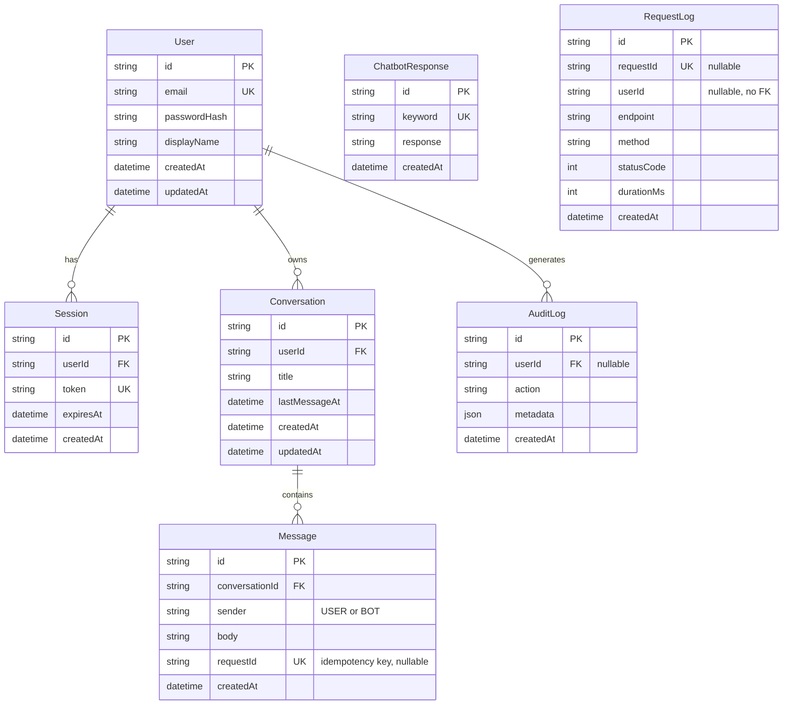

# Database ER Diagram

Renders automatically on GitHub (Mermaid is supported natively in `.md` files). Generated from
`backend/prisma/schema.prisma` — if the schema changes, update this diagram to match in the same
commit.

## Notes on the design

- **`ChatbotResponse` and `RequestLog` have no foreign keys to `User`/`Conversation`.**
  `ChatbotResponse` is global reference data (keyword → reply), not owned by anyone.
  `RequestLog.userId` is stored as a plain string, not a FK, on purpose: request logs should keep
  existing even if the user who made the request is later deleted (the log describes what the API
  did, not something that belongs to the user's account).
- **`AuditLog.userId` IS a nullable FK with `onDelete: SetNull`** — deleting a user preserves the
  audit trail (doesn't cascade-delete history) but nulls out the reference, since GDPR-style
  "right to erasure" scenarios shouldn't leave a dangling foreign key.
- **`Message.requestId` is unique but nullable** — most messages won't be retried, so most rows
  have no idempotency key. Postgres allows multiple `NULL`s in a unique column, only enforcing
  uniqueness among the non-null values, which is exactly the semantics wanted (see
  `README.md` § Day 3 for the idempotency reasoning this constraint supports).
- **Cascades:** deleting a `User` cascades to their `Session`s and `Conversation`s; deleting a
  `Conversation` cascades to its `Message`s. Deleting a user is meant to actually remove their
  data, not orphan it.
